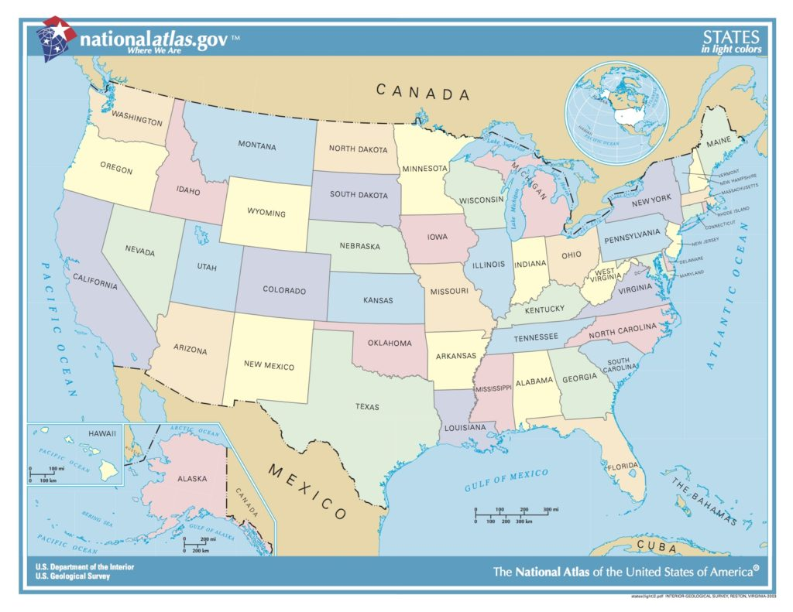
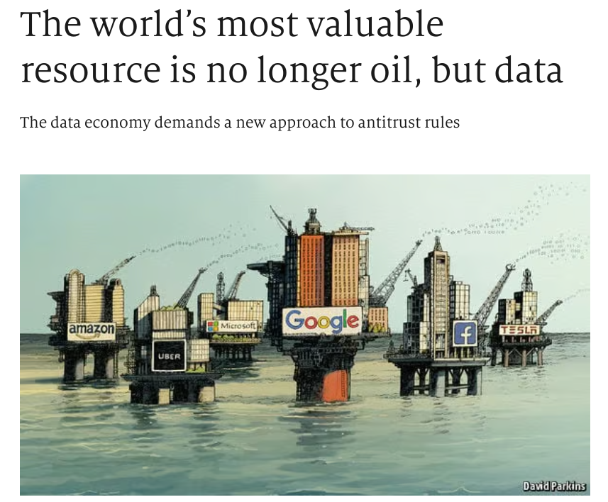

# Lesson 1: What is data

## Objectives

- Understand the definition of data
- Understand why it's important to learn about data

## Concept

### Defining Data
The word data, as defined in a dictionary, has a couple of different meanings:
- facts or information used usually to calculate, analyze, or plan something
- information that is produced or stored by a computer

For our purposes, we'll be focusing on the first definition, specifically that data is facts or information. That is a very wide open definition but it is useful as a starting point to understand data as facts.

To expand on the definition of data as facts, I suggest that we think of data as a fact that can be assigned to something (or someone). So the fact that the United States land area us around 3.8 million square miles is data because it is a fact about the United States. If I just told you the information *3.8 million square miles*, then that is just a number that isn't associated with something.

Similarly, if I told you the information *6 feet, 6 inches*, that wouldn't necessarrily be data. But if I tell you that the average height of NBA basketball players is *6 feet, 6 inches*, that is a piece of data. And it becomes a piece of data that can be compared to another piece of data, such as the fact that the average height of an NFL football player is *6 feet, 2 inches*.

Another important aspect of the definition of data is that it has to be something that can be measured or compared. That is, the fact or information that is attributed to something has to mean thing. If I tell you that my sister is smart, that isn't necessarrily a measurable piece of information. Rather, it is a subjective quality. Now if I tell you that my sister's IQ is 140, that becomes a measurable piece of information that qualifies as data.

Let's take another example about weather. If I tell you that yesterday was windy, that is a piece of information that is attributable to something (specifically yesterday), but it is not measurable unless you include how windy is was, say 30 miles per hour.

One clarification here is that subjective attributes like smart and windy could become measurable if they become a comparable attribute. For example, you could classify each day in terms of weather as windy, sunny, cloud, rainy, snowy, and so on. And then you could analyze the patterns of weather by days using that. So facts or information can become measurable if they are collected in such a way that they can be related to comparable attributes.

To summarize, data is a:
- fact or piece of information
- that is attributable to something (or someone)
- that can be measured or compared

### Why learn about data

Now that we know what data is, why does it matter to learn about data and how to use it effectively?  Data has become central to so much of what happens in the world.  With the amount of avavailable data growing each day, we are finding more use cases to use data to make decisions and to even automate tasks.  Data is powering much of the revolution in artificial intelligence and every industry is now looking to leverage data for advancements.

*Source: Economist (2017)*

Understanding how to work with data is important for problem solving and innovation.  Data analysis is useful for identifying pattern and trends in information.  Exploring data can help uncover new opportunities for innovation.  Given how much the world uses data, having an understanding of data is imperative to make sense of what is happening.

### Where we're headed

For our journey into the world of data, we're going to start with **concepts** about data and then move into **practices** of data. It is important to understand key concepts about how to collect data, organize data, summarize data (and more) before we work to understand the practices of data including how to use computers effectively to work with data.

In the concepts portion, we'll use examples of sets of data to help us understand better the various principles of data. And then in the practices section, we'll have different tools to leverage to work with sets of data.

## Practice: Creating Your Data

For our first practice, it will be an exercise for you to define data about yourself.  Think about what attributes make up who you are.  And then consider how your attributes can be measured or compared to others.  

For example, you can think about how tall you are or what your hair color is.  Write down a set of attributes and you know have entered the world of data!

## Summary

Data is fact or piece of information that is attributable to something (or someone) and that can be measured or compared.  Data is a key part of how the world works and understanding how to work with data is a very critical skill in our world.
