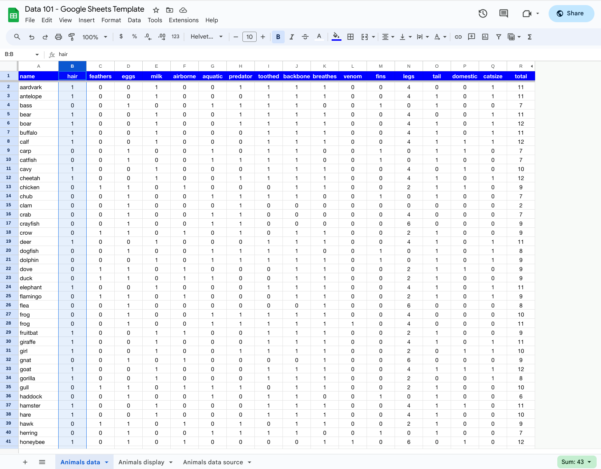
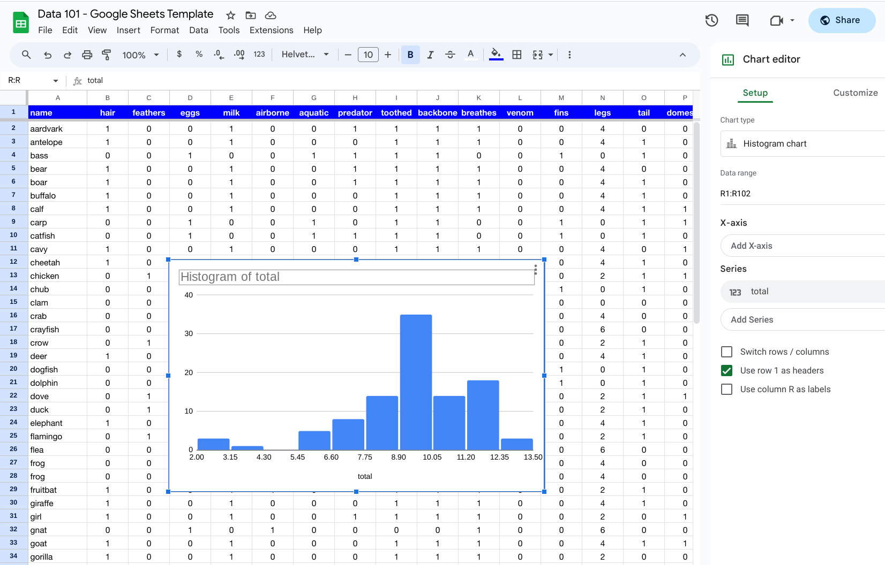

# Lesson 2: Collecting and displaying data

## Objective

- Understand how to collect data
- Practice exploring data in Google Sheets 

## Concept

### How to collect data
We now can build on our definition of data as a fact that is attributable to something and that can be compared by thinking about how to collect data.  The process of collect data simply involves making a record of the facts that we want to use later on.  Before we start collecting data, there are some important things to think about:

- What is the main object that we are attributing the facts to -- a person, a country, etc.?
- What facts do we want to collect?
- How will the facts be compared?

Let's look at each of these individually to help see the importance of thoughtfully collecting data.  After that, we'll walk through a few examples of collecting data to see the questions in action.

**What is the object we are interested in?**

It is best to start with the object of our data as that will then help us answer the other questions.  In figuring out the object of our data collection,we want to think about what is the main object that we are looking to analyze.  If it is a person, then we can think about what specific attributes related to a person that matter to us in what we're trying to accomplish.  If it is a country, then we can think about attributes that are related to a country.  

It is possible to have multiple objects that are related that you want to attribute facts to.  There could be different layers that you want to group together.  A simple example would be countries and cities.  You want to collect data about cities, but you also want to keep track of what country a city is associated with.  While the country could be considered another piece of data about the city, it is better to think about it as another part of the object that you are collecting data about.

**What facts do we want to collect?**

Once you have the object identified, then you can move on to the facts that you want to collect.  In some respects, this is the simplest question because you can brainstorm all the various items that are interesting for you.  You can think of the various attributes for an object that are relevant and keep track of them as you will use them when collecting data.

**How will the facts be compared?**

The final question helps to shape the facts that you want to collect.  After you have the list of facts that you are interested in collecting, you want to make sure you know how you will assign the facts as you collect them.  Here is where you start to define how you will measure and collect facts.

For example, in the weather example, are you going to collect the type of weather -- windy, sunny, rainy, cloudy -- for a given time period or will you collect a specific quantitative measurement such as temperature or wind speed?  A way to think about this is what you have to note down for each type of fact what are the types of values you will collect for each fact.  Or more specifically, you can establish a *range* of possible values for a given fact. 

It's time to look at some examples to help us understand all of this better.

### Example 1: Countries

Let's go through an example of collecting data about countries of the world.  The object that we will be collecting facts about is a country.  Next we want to consider what facts about countries that we want to collect.  Possible facts to collect include:

- Population
- Size in area
- Flag
- Largest city
- Government type
- Languages
- Literacy rate

For each of these, we can now consider how we would compare the facts between countries.  For example, the population of one country can easily be compared to the population of another country because they are both numbers.  However, when we consider the flag of a country, that is more difficult to compare to another country.  We would have to collect certain attributes about the flag, the number of different colors or a list of all colors or event specific characteristics like if the flag has stripes or stars.  Those attributes wouldn't be compared as you would compare a number but could be compared in terms of grouping countries by what colors they have in their flag.

Now think about how we could compare the largest city between two countries.  The name of the largest city in two countries is not easy to compare, so that would not be a good fact to collect about a country even if it is interesting to know.  

In general, when we think about what we want to compare for facts, we can group them into numbers or categories.  In thinking through how to compare the facts of a country, it will help us define what data we actually want to collect.  Here is an example of a few of the country facts along with how we can compare them and then what to collect:

| Fact | What to compare | What to collect | 
| ---- | -------------- | --------------- |
| Population | Number | Total number of people  |
| Size in area | Number | Total size in square kilometers |
| Languages | Number | Total number of languages |
| Flag | Category | List of colors |

## Practice: Animals in Google Sheets

### Accessing the template

We can now work with an actual set of data to compare and analyze different attributes.  We will be using an animal data set that has 101 animals and various attributes about them.  To find the data, you can go to this link which is a Google Sheets template: [link](https://docs.google.com/spreadsheets/d/1asDk3ut3HyWBDQPqMfdh1lQ7scmwQM1stqaSRJd1EuY/edit?usp=sharing).

After opening the link, you will want to save your own version of the Google Sheets file by going to File -> Make a copy from the menu and you can rename it to whatever you would like.

### Exploring the data

To explore the data, let's start by looking at a few columns.  Each column represents an attribute for the animals.  If you select Column B by clicking the B at the top of the column, you will see a `Sum: 43` show up in the bottom right part of the Google Sheet.  That represents summarized information about the column that you have selected.  The value of 43 indicates that there are 43 animals that have hair. 

If you continue to look at other columns, you will see that the majority of them have values of 0 or 1.  Those columns represent **yes or no** characteristics where a 1 indicates the animal has the attribute and a 0 indicates the animal does not have the attribute.  These types of characteristics are also known as **Boolean** (true or false) or **binary** (0 or 1) attributes.

If you scroll to the right, you will see a column called *legs*. That column is not a Boolean or binary attribute since the values range from 0 to 8.  The last column on the right is a column *total* which was added by summing up the values of all the attributes.  

### Displaying the data

We can take our exploration a step further by displaying the data. To create a chart in Google Sheets, you first need to select the data you want to display. For a simple example, let's select the *total* column (which is Column R in the Google Sheet).  After that is selected, go to the menu at the top and navigate to Insert -> Chart.  Once you set the Chart editor menu on the right, select the Chart type to be *Histogram chart*.

## Summary
