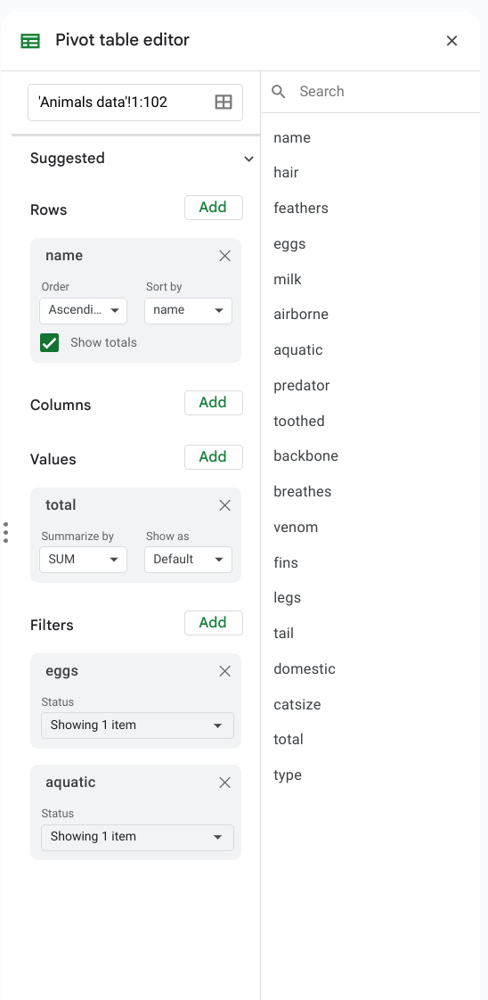
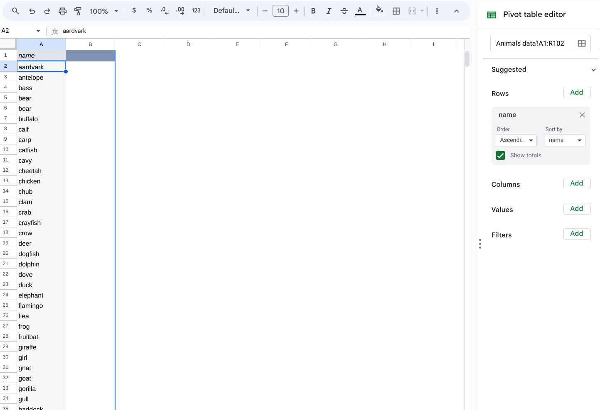
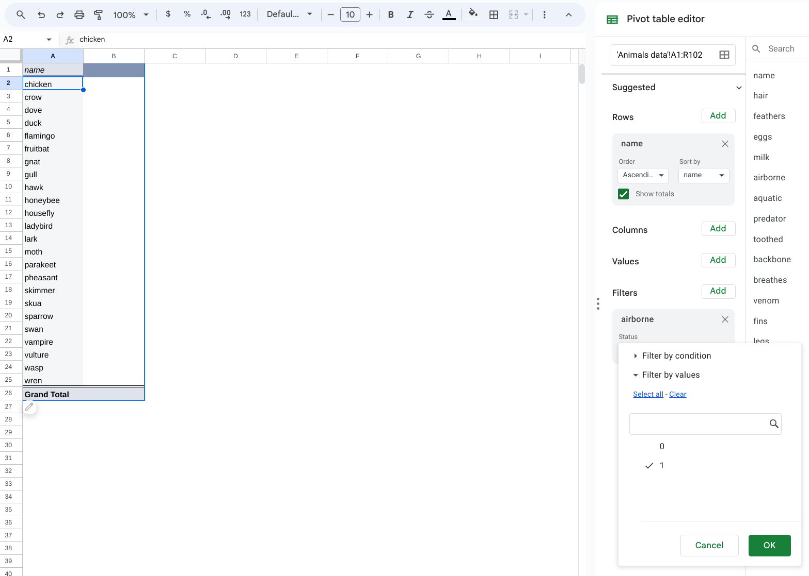

# Lesson 3 - Querying data in a pivot table

## Objective

- Understand what a query is
- Build a pivot table in Google Sheets

## Concept

When we have a dataset, one of the main uses of it is to get answers from the dataset for questions that we are interested in.  When we ask a question to a dataset to get an answer, we call that a **query**.  A query is a structured way to communicate what specific information we want to extract from a dataset.  When we structure a query, we are usually trying to get answers related to the records in the dataset or the fields in the dataset, and often times we want a combination of both.  Remember that the records in the dataset are represented by individual rows of data that each represent a set of attributes about an object.  The fields in the dataset are those specific attributes that we have collected for our objects.

If we query data specifically to get a set of records, then we normally will structure our query to select records based on certain values of the attributes.  For example, in our countries example from the previous lesson, if we want to only see records for countries that have population greater than 100 million, then we would write the query such that it only includes those records.  When we are making a selection of records with conditions to pick what we want, that is done using a **filter** in our query.

If we want to query data to only retrieve a set of fields, then we can do that by only selecting the attributes that we are interested in.  This is done by **selection** when writing a query.

## Practice: Building a pivot table

To put this into practice, we will now build what is called a **pivot table** in Google Sheets.  A pivot table allows us to take our dataset and query it using a simple interface.  To get started, go to your Google Sheets with the Animal Data, then navigate to *Insert -> Pivot Table*.  

It gives you the option of where to create the pivot table, so you can choose to create it in a *New sheet*.  That will then create the pivot table in a new tab in your Google Sheet.

Once you have the new sheet with the pivot table, we can start to build a query.  You will see a *Pivot table editor* on the right side of the Google Sheet and that is where we can pick what we want for our query.  There are lots of parts of the editor which lets us query the data in different ways.

To start, you can add the *name* field for Rows.  After you do that, you will see the full list of names show up on the left side of the Google Sheet.  In doing that, we have done a **selection** by choosing a specific field to show from the data.

To do a **filter**, we can go to the Filters part of the *Pivot table editor* and then select a field to use for our filter.  Let's try to find animals that are airborne, so you can select the *airborne* field, and then navigate to the *Status* and click on *Show all items*.  From there, you can uncheck the 0 value which will then filter for animals that are airborne because they have a value of 1.  Press OK, and then you will see the names reduce to only those animals that are airborne.  

Congratulations!  You have completed your first query using a pivot table.  Thinking back to how we defined a query as a question that you ask of a dataset, we can now map what our question was.  In selecting the name field and then filtering by airborne animals, we asked the question of the dataset: What are the names of animals that are airborne?  You can see how our question really was in two parts -- selecting what information we wanted (names) and then filtering what specific names we were looking for (airborne).  This is the basic structure of how we query data.

## Practice: Building your own queries

Now it is time for you to figure out how to build your own queries using a pivot table.  Here are 3 questions that you ask of our animals dataset and that you can get an answer using the pivot table:

- What are the names of animals that are predators?
- What are the names of animals that have fins and a tail?  Hint: you'll have to add multiple filters.
- What is the total number of attributes for the animals by name?  Hint: you'll have to use the *Values* part of the pivot table editor.

## Summary

A query is a question that you ask of a dataset.  A basic query consists of selecting the fields that we want and filtering records based on what we want to see.  A pivot table can be used to build a query in Google Sheets.

