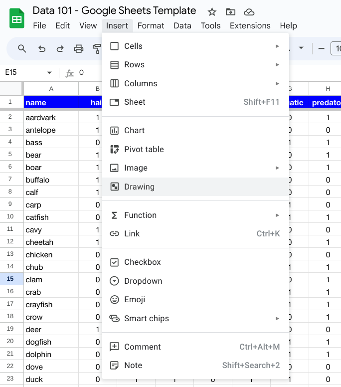
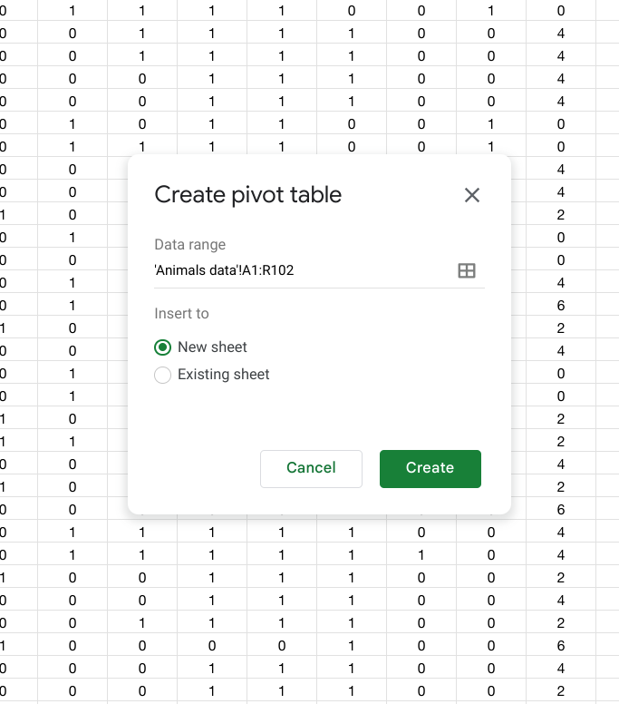

# Lesson 3 - Querying data in a pivot table

## Objective

- Understand what a query is
- Build a pivot table in Google Sheets

## Concept

When we have a dataset, one of the main uses of it is to get answers from the dataset for questions that we are interested in.  When we ask a question to a dataset to get an answer, we call that a **query**.  A query is a structured way to communicate what specific information we want to extract from a dataset.  When we structure a query, we are usually trying to get answers related to the records in the dataset or the fields in the dataset, and often times we want a combination of both.  Remember that the records in the dataset are represented by individual rows of data that each represent a set of attributes about an object.  The fields in the dataset are those specific attributes that we have collected for our objects.

If we query data specifically to get a set of records, then we normally will structure our query to select records based on certain values of the attributes.  For example, in our countries example from the previous lesson, if we want to only see records for countries that have population greater than 100 million, then we would write the query such that it only includes those records.  When we are making a selection of records with conditions to pick what we want, that is done using a **filter** in our query.

If we want to query data to only retrieve a set of fields, then we can do that by only selecting the attributes that we are interested in.  This is done by **selection** when writing a query.

## Practice: Building a pivot table

To put this into practice, we will now build what is called a **pivot table** in Google Sheets.  A pivot table allows us to take our dataset and query it using a simple interface.  To get started, go to your Google Sheets with the Animal Data, then navigate to *Insert -> Pivot Table*.  It gives you the option of where to create the pivot table, so you can choose to create it in a *New sheet*.

## Summary

