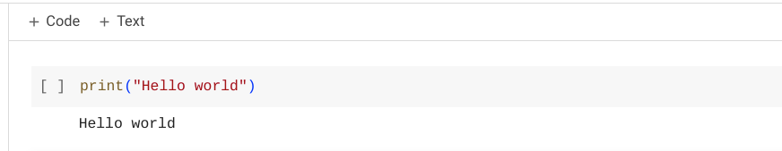
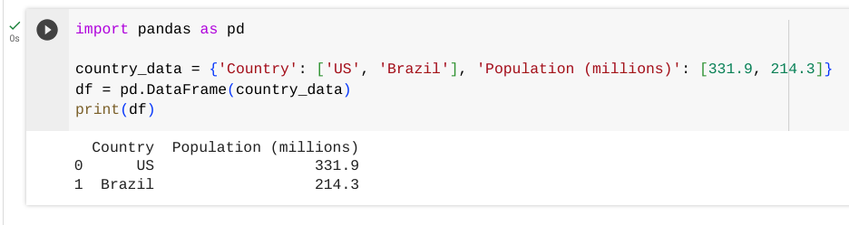

# Lesson 4 - Loading data in Python

## Objectives

- Learn how to create a dataset in Python
- Learn how to load a dataset in Python
- Create a Google Colab notebook

## Concept

We are shifting from using Google Sheets to now using the Python programming language to work with data.  Python is an easy-to-use language that was created over 30 years ago.  It has many libraries that are simple for working with data.  The main library that we'll be using is Pandas.  In Pandas, datasets are stored in a **dataframe** that is a way to store the data as rows and columns to represent the records and fields for the dataset.  


The dataframe structure should look similar to the Google Sheets data that we have looked at previously.  You will see rows and columns of data to represent the records and fields for the dataset.  As we write Python code to work with dataframes, we will start by using **functions** -- modules of code that accomplish a specific task -- to run queries.  

During the practice portion of the lesson, you will be using a Google Colab Notebook to write code and see results.  To create a Google Colab notebook, go to [[https://colab.research.google.com]] and then navigate to `File -> New Notebook`.  


Once you have your new notebook, you are ready to being the practice portions of this lesson.

## Practice: Creating a dataset in Python using Google Colab

If your new notebook, you can see add snippets of code into what is called a **cell** and then run the cell to execute the code.  To start, let's put in a simple statement to print out text and then run the cell by clicking the play button.  This is what you should see after the cell is played:



Going forward, you can copy the code that is displayed here into a new cell in your notebook and then run it by pressing the play button to the left of the cell.  Here we will create a simple dataframe and print it:

```
import pandas as pd

country_data = {'Country': ['United States', 'Brazil', 'Spain', 'Thailand'], 'Population (millions)': [331.9, 214.3, 47.42, 71.6]}
df = pd.DataFrame(country_data)
print(df) 
```

Let's go through this code line by line to understand what is happening.  The first line of code is importing the Pandas library so we can use it in our notebook.  Then we create data with that two different fields (Country and Population) with 4 total records, one for each of the country.  Our data is stored in a variable called country_data.  After that, we create the dataframe by passing the data into the pd.DataFrame function and storing it in the df variable.  Finally, we print out the contents of the dataframe that we have created in the df variable.  The output that is printed should look familar in seeing the data represented in rows and columns for the records and fields in the dataset that we have created in the dataframe.



## Practice: Loading a dataset in Python using Google Colab

## Summary

