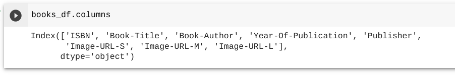
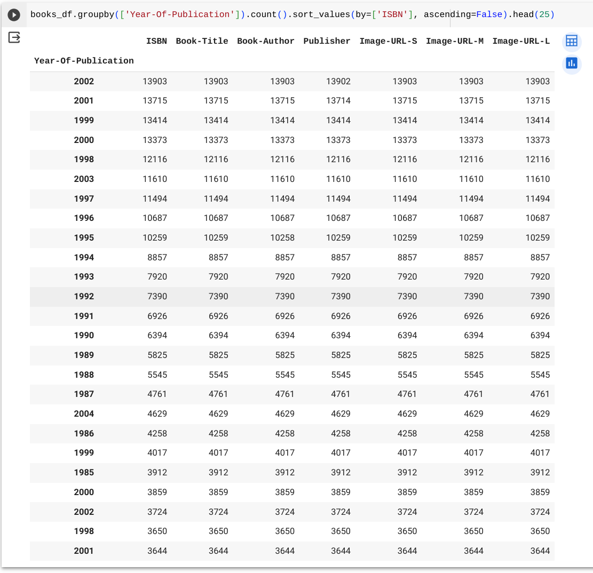

# Lesson 5 - Querying data in Python

## Objective

- Learn how to use functions with dataframes to query data
- Understand how to map a question about a dataset to Python code

## Concept

We'll pick up where we left off with our book ratings dataset to understand more about how to query a dataset.  Remember that we loaded in a dataset and created 3 dataframes: `ratings_df`, `books_df`, and `users_df`.  We can see the names of the fields inside a dataset by calling the `columns` attribute for the dataframe:



Now that we know the fields that are in the books dataframe, we can query the dataset.  To query data using Python, we will call functions for our dataframe objects.  Last lesson, you did an example of a function with the `info()` function.  When building a query using functions, you can build functions together in a single line of code to make the query simpler.  

Let's start by querying the books dataset to figure out which year of publication had the most books in the dataset.  Here is a single line of code for that query:



```
books_df.groupby(['Year-Of-Publication']).count().sort_values(by=['ISBN'], ascending=False).head(25)
```

This single line of code looks complicated, so let's break it apart to see the various functions that are being called.  We start with the dataframe representing the books dataset.
```
books_df
```
After that, we call the `groupby` function with the field `Year-Of-Publication` to say what we want to group the dataset by.  
```
book_df.groupby(['Year-Of-Publication'])
```
The purpose of a grouping function is to then summarize other fields in the dataset by another function.  The most common summarizing functions are counting and summing.  If you do a `groupby` function without any other functions, it won't give you any additional information.  You have to do the `groupby` function with another function to get an answer.  For this example, we'll be summarizing with a count function.
```
book_df.groupby(['Year-Of-Publication']).count()
```
The `count()` function simply adds up how many records there are for each value in each group.  In this case, our group is year of publication so that means we'll get a count of how many books were in each year in our dataset.  Next we want to sort the data to see the year with the most number of books at the top.
```
book_df.groupby(['Year-Of-Publication']).count().sort_values(by=['ISBN'], ascending=False)
```
We use the `sort_values()` function to sort the data and we give it two pieces of information.  The first item is what field to sort by.  In this case, it doesn't matter what field to sort by since we've counted up all the values which would be the same for all the fields.  So we have given it the `ISBN` field but we could have given it any fields.  The second information we pass to the `sort_values()` function is how we want to sort.  Because we want the highest values at the top, we want it in descending order which is the opposite of ascending; so we say that ascending is False to tell it what order to do.

We've got the data grouped and counted and sorted, so now we're ready to see the top results.
```
book_df.groupby(['Year-Of-Publication']).count().sort_values(by=['ISBN'], ascending=False).head(25)
```
The `head()` function will output the first 25 records of the data output from our query.  This allows us to pick how much data to look at; in this case, we have chosen 25 records but we could have chosen a smaller or larger number of records if we wanted.

## Practice: Building your own queries in Python using Google Colab

OK, now you've seen functions in action to build a query for our datasets, so now it's your turn.  We'll go through a couple examples together and then I'll give you a couple queries to build yourself.  

As we build a query, we first start with what question we want to ask of the dataset and then we build the query to represent that question.

### What auther published the most books in 2002? 
```
books_df[books_df['Year-Of-Publication'] == '2002'].groupby('Book-Author').count().sort_values(by=['ISBN'], ascending=False)
```

For this query, we are adding a filter based on the `Year-Of-Publication` field.  To check to make sure the publication year is 2002, we add the `==` operator to check that it is true.  

### How many books start with each letter of the alphabet?

For this query, we first need to create a new field in the books dataset that represents what the first letter of the book is:
```
books_df['Book-First-Letter'] = books_df['Book-Title'].astype(str).str[0]
```
Then we can do the query to count how many books start with each first letter:
```
books_df.groupby('Book-First-Letter').count().head(25)
```

### Build your own queries

OK, now that you've done a couple examples yourself, try to build queries to answer these questions
1. What is the age of the users who did reviews grouped by each age?  Hint: you will have to use the users dataset for this query.
2. What is the overall average age of users?  Hint: you will have to use the `mean()` function.
3. What is the number of ratings at each ratings (0 - 10)?  Hint: you will have to the use the ratings dataset.
4. What is the overall average book rating from all ratings?  Hint: you will have to use the `mean()` function.
5. How many distinct authors are in the dataset?  Hint: you will have to use the books dataset and the `nunique()` function.

If you have successfully built all of those queries to answer the questions, then you are ready to move on.

## Summary
In this lesson, we learned how to write queries in Python using functions.  We explored our book ratings datasets to ask questions of the data.  We used different functions to help us get the answers we wanteds.  Some of the functions included: `count()`, `groupby()`, `sort_values()`, and `head()`.

