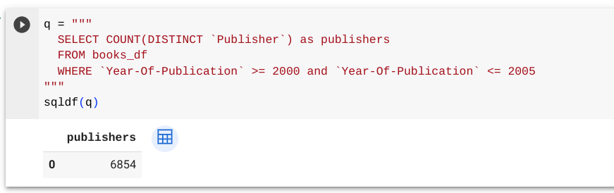

# Lesson 7 - Advanced SQL queries

## Objective

- Learn how to write more advanced SQL queries
- Understand different ways to filter data in SQL
- Understand how to query for distinct counts

## Concept

Now that we've learned how to write SQL queries to ask questions of data, we're going to introduce a couple new areas to help us write more advanced queries.  Both of these concepts are related to the types of queries we've already written.

### Filtering

Remember that we can filter data in a SQL query in the **WHERE** part of the query.  Last lesson, we did a simple query for authors in the year 2002 using the `=` expression.  We're going to explore different ways to filter data as that is a key part of a query that helps us get the answers from the data that we are looking for.

When working with a field that is a number, you can do various expressions to represent the filter.  We've seen the `=` expression but you can also use `!=` which equates to does not equal.  You can also use `<`, `>`, `<=`, `>=` which are related to less than or greater than and also those expressions with equality.  Hopefully they are familiar to you from other math lessons that you've had.

When working with a field that is a string, you can still use the `=` and `!=` expressions for strings to exactly match or not match.  Another expression you can use is the **LIKE** keyword which tries to match a string with part of the record in the dataset.  For example, if you wanted to filter out books that had `Harry Potter` in the title, you couldn't do an `=` or `!=` without listing all the titles which you may not know.  Instead you could use the **LIKE** keyword with a expression such as this:
```
`Book-Title` LIKE '%Harry Potter%'
```
You can see the extra `%` characters around the word that you are matching (Harry Potter).  The `%` characters represent that any other characters can be present in that place.  In our example, we're saying that anything can go before or after `Harry Potter` as long as that is in the field.   

### Distinct Counts

You've already seen us counting up values but you can also count up distinct values.  This is useful if we want to ignore duplicates.  For example, if we want to know the unique (or distinct) number of authors from our data set, we can use this expression:
```
COUNT(DISTINCT `Book-Author`) as authors
```
It uses the **COUNT** function and then inside of it, it will use the **DISTINCT** keyword.

### Example: Unique Publishers

Let's put these two concepts together in an example.  Let's ask the question of how many unique publishers are there between the years of 2000 and 2005.  Here's what the query would look like:



The query returns a single number which represents the number of distinct publishers in those years.

## Practice: Building advanced queries

### What cities in the United States have the most users?

To answer this question, we'll have to make use of the **LIKE** operator to filter records with the location of the United States.  Specifically, we'll want to look for the matching string `usa`.  Here's the query to use:
```
query = """
  SELECT `Location`, count(*) as total
  FROM users_df
  WHERE `Location` LIKE "%usa%"
  GROUP BY `Location`
  ORDER BY total desc
sqldf(query)
"""
```
Notice that we are adding an **ORDER BY** as the end of the query to sort the data from most users to least.

### How many ratings were between 6 and 10?

This will make use of the **WHERE** clause to filter out the ratings that we want.  Here's the query:
```
query = """"
  SELECT `Book-Rating`, count(*) as total
  FROM ratings_df
  WHERE `Book-Rating` >= 6 and `Book-Rating` <= 10
  GROUP BY `Book-Rating`
  ORDER BY `Book-Rating`
"""
sqldf(query)
```

### Build your own queries

Now try to build your own advacned SQL queries.  Here are a few to start with:
1. What book (ISBN) has the most ratings = 10 and which book (ISBN) has the most ratings = 0?
2. What is the average age for the top cities in the United States for users in the dataset? (Hint: use the **AVG** keyword in your SQL query.)
3. How many unique publishers did J.K. Rowling use for her Harry Potter books?

## Summary
In this lesson, we learned about how to do more advanced queries, specifically in how to filter records for number and string fields.  We also learned about how to count unique values in a dataset with the **DISTINCT** keyword.

## Answer key
1. What book (ISBN) has the most ratings = 10 and which book (ISBN) has the most ratings = 0?
```
query = """
  SELECT `ISBN`, count(*) as total
  FROM ratings_df
  WHERE `Book-Rating` = 10
  GROUP BY `ISBN`
  ORDER BY total desc
"""
sqldf(query)

query = """
  SELECT `ISBN`, count(*) as total
  FROM ratings_df
  WHERE `Book-Rating` = 0
  GROUP BY `ISBN`
  ORDER BY total desc
"""
sqldf(query)
```

2. What is the average age for the top cities in the United States for users in the dataset? (Hint: use the **AVG** keyword in your SQL query.)
```
query = """
  SELECT AVG(`Age`)
  FROM users_df
  WHERE `Location` LIKE "%usa%"
"""
sqldf(query)
```

3. How many unique publishers did J.K. Rowling use for her Harry Potter books?
```
query = """
  SELECT count(distinct `Publisher`)
  FROM books_df
  WHERE `Book-Title` LIKE "%Harry Potter%" and `Book-Author` LIKE "%Rowling%"
"""
sqldf(query)
```
