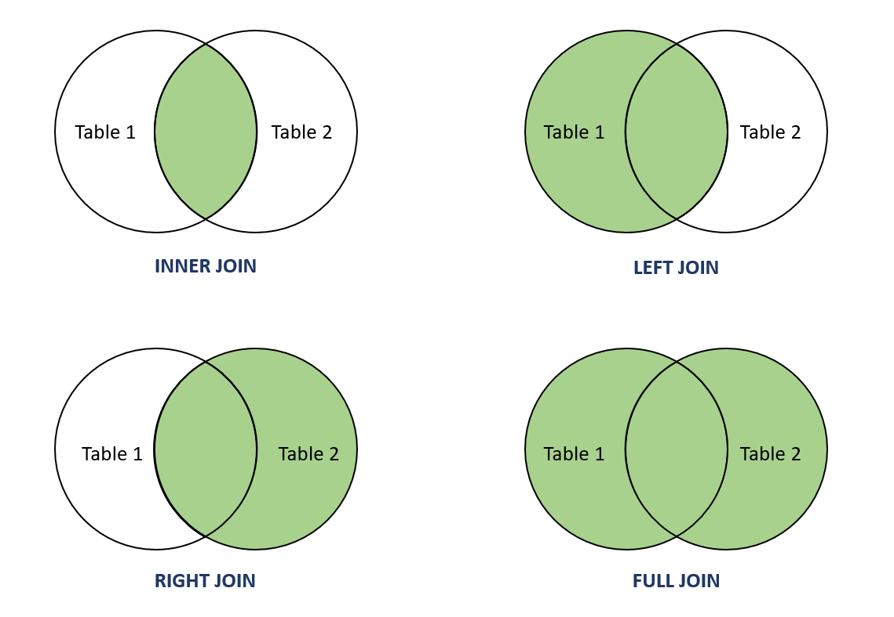
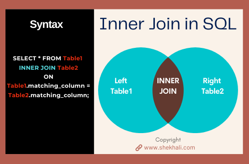

# Lesson 8 - Joining data in Python

## Objective

- Learn the different types of joins
- Understand what a join key is in SQL
- Practice doing inner joins in SQL

## Concept

We are now going to talk about an important concept when working with data: joins.  When you want to bring data together from two different datasets, or tables, you will need to do a join.  There are different types of joins as represented in this diagram:


*Source: alphacodingskills.com*

An **inner join** is the most exclusive join where it allows you to filter records between two tables that have a common field that can be joined.  A **left join** and **right join** both keep all records from one table and then add in extra fields from the other table; in those joins, the number of records will be equal to the table on the side of the join (left or right).

The final type of join is a **full join**, sometimes called a **full outer join**.  In this join, the records will include all records from both tables and bring fields from both tables together in the join output.

Now let's look at how an inner join is actually written in SQL:



The keywords **INNER JOIN** are used to separate the names of the two tables being joined.  Then the **ON** keyword is used to then specify which fields from each table are used in the join.  In general, there is one field from each table in the join.  The field names from each table do not need to have the same name.  The output of the inner join query will usually be less records than there were in each of the two tables, because the join will select only records that match the join condition.

When you are doing a join, the fields that you specify as part of the join condition are known as **join keys**.  A join key is a field inside a table that can be used to join data with another dataset or table.  In our books datasets, here is a diagram showing the join keys between the tables:


The join key between the books and ratings datasets is the `ISBN` field while the join key between the ratings and users datasets is the `User-ID` field.  

## Practice: 

Now that we've walked through what a join is and understand the join keys for our books data, let's write some join queries in SQL.  For our first query, let's answer the question for what are the books that have the most ratings.

```
query = """
  SELECT `Book-Title`, count(`Book-Rating`) as rating_count
  FROM ratings_df
  INNER JOIN books_df
  ON ratings_df.ISBN = books_df.ISBN
  GROUP BY ratings_df.ISBN
  ORDER BY rating_count DESC
  LIMIT 10
"""
sqldf(query)
```

From this query, you can see how the join key of `ISBN` is used in the join condition to join the two tables together.  In the `SELECT` part of the query, we are combining a field from the books dataset (title) along with a field from the ratings dataset (rating) which shows an example of how join queries are useful.  

Let's try one more join query for this lesson.  The question for this query will be what is the age and location of the users that have the most number of ratings.  For this query, we'll join together the ratings and users datasets using the `User-ID` join key.

```
query = """
  SELECT `Age`, `Location`, count(`Book-Rating`) as rating_cnt
  FROM ratings_df
  INNER JOIN users_df
  ON ratings_df.`User-ID` = users_df.`User-ID`
  WHERE `Age` is not null
  GROUP BY ratings_df.`User-ID`
  ORDER BY rating_cnt DESC 
  LIMIT 10
"""
sqldf(query)
```

Note that the query includes a `WHERE` section to filter out any records where the age is not present with `is not null`.  

## Summary

In this lesson, we learned about join queries in SQL and how they are used to bring together data from different tables.  We also learned about what a join key is and how it represents the link between two datasets.  
