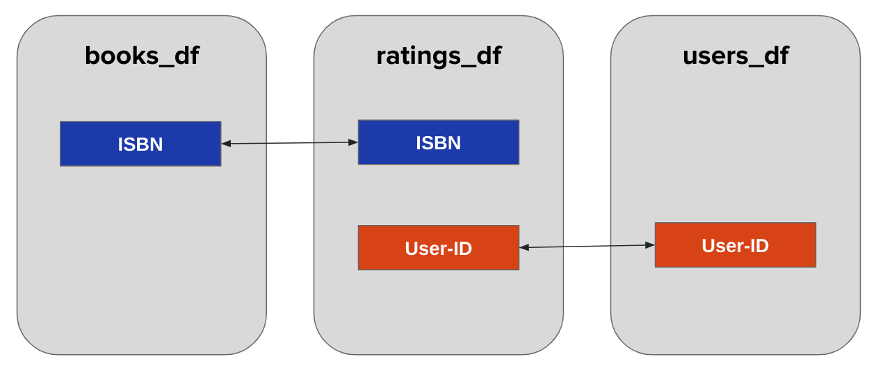
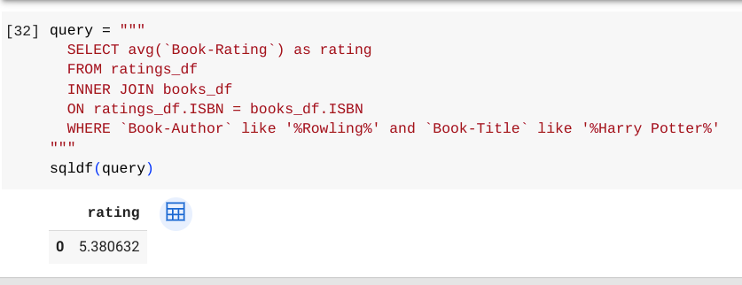
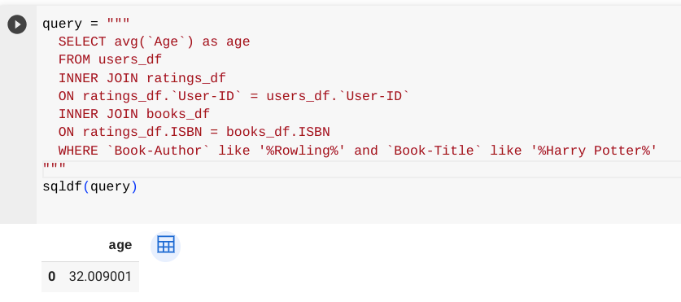
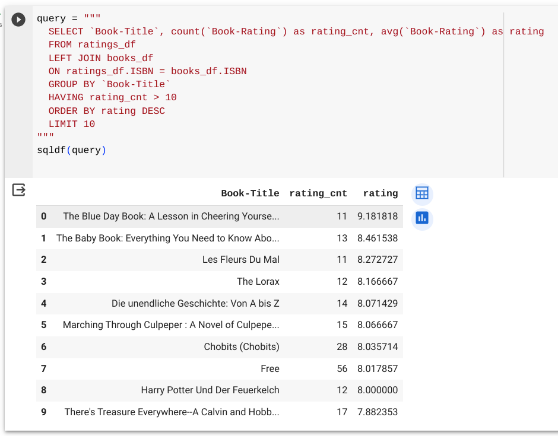

# Lesson 9 - Advanced join queries

## Objective

- Understand how to build advanced queries with joins
- Practice building queries with multiple joins and non-inner joins

## Concept

We introduced the concept of joins last lesson and here is a reminder of the join keys between the tables in our books datasets:

Let's start by doing an inner join to find the average ratings for all Harry Potter books.

We joined the books and ratings data and also included a filter for Harry Potter books using the `WHERE` keyword.  It is possible to do more than one join in a query, so let's see how we can join all 3 datasets together in a single query by doing two joins.  We'll answer the question of what the average age is for users who gave ratings of Harry Potter books.

In the query, you can see how there are two separate `INNER JOIN` sections as each of them will join two datasets together to allow all three to be combined.

Now let's look at a left join for an example of bringing two datasets together where we have all the records from one dataset and then add fields from another in our query.  This query is asking which books have with the highest ratings, given that the book has more than 10 ratings:

There's a lot going on in this query, so let's take note of a few key parts:
- The left join is with the ratings dataset the one we want all the records from since we are counting up ratings.
- The query uses the `avg` function to calculate the average rating.
- The query uses the `HAVING` keyword to filter for books that have more than 10 ratings.  This filter had to be done in the HAVING part and not in a WHERE part of the query since we didn't know the number of ratings per book until after the data was grouped together.

## Practice: Writing your own advanced join queries 

Now you're ready to write your own advanced join queries in SQL with our books datasets.  Here are a few challenging queries to write:
1. What user location has the most number of book ratings?
2. What publication year has the least popular books by average rating that has more than 10 ratings?
3. What age of users has the highest average rating for books that were published between 2000 and 2003?

## Summary
In this lesson, we wrote more advanced queries including a multi-join query to join three datasets together and also a left join.  We also saw how join queries can include other functions and filters to get the answer desired from the query.
