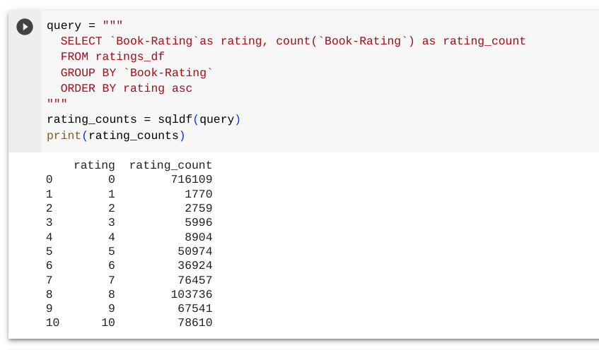
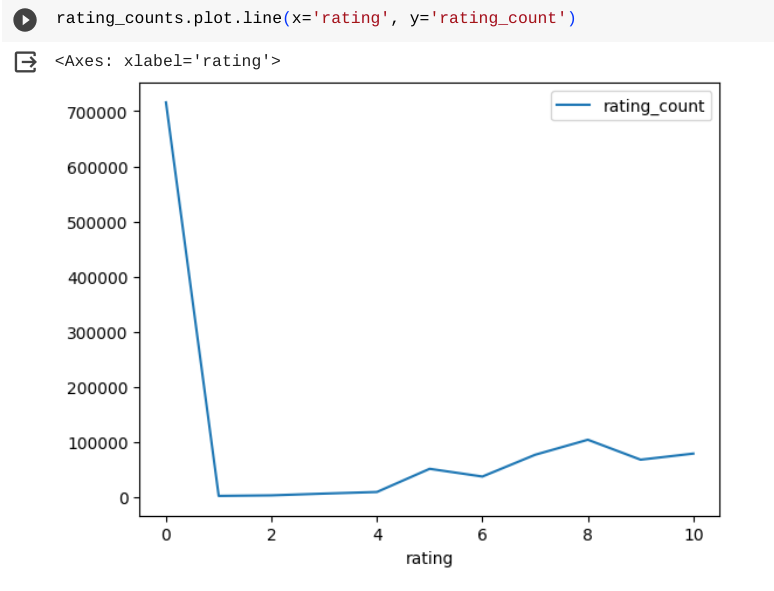
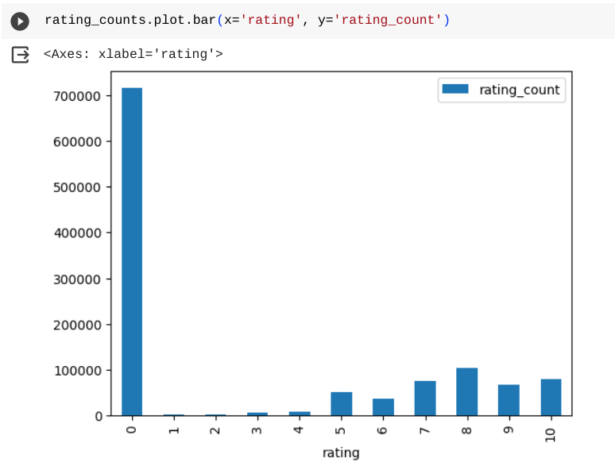
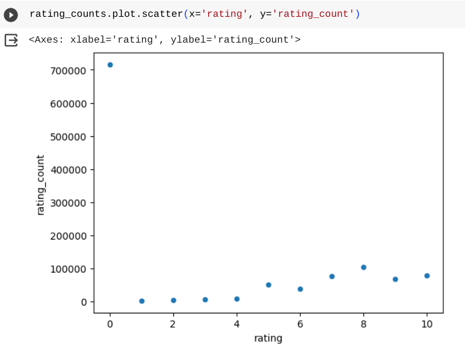
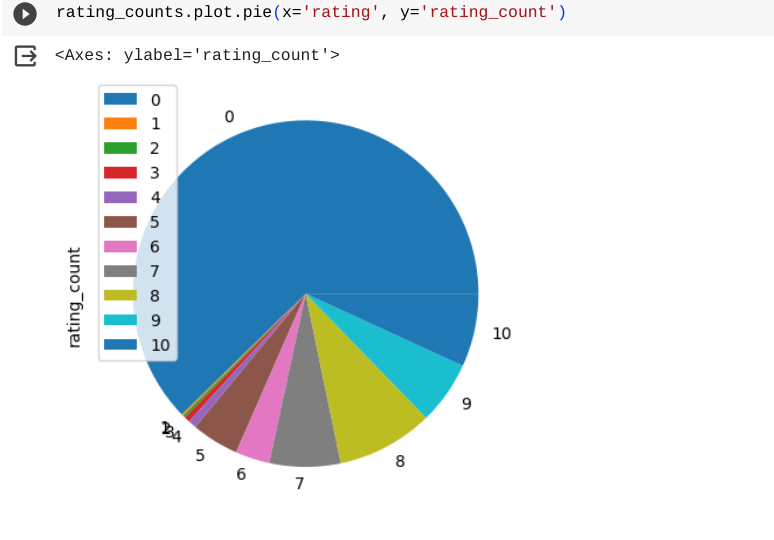
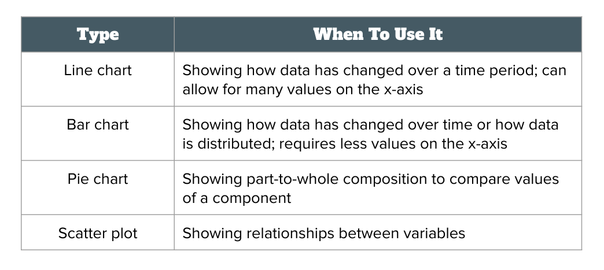

# Lesson 10 - Data visualization in Python

## Objective

- Learn about different types of data visualizations
- Understand how to use different visualization functions in Python
- Know when to use which type of data visualization

## Concept

We're going to go beyond querying data and look into how to visualize data.  Data visualization is important because it can help us understand data in different ways than looking at records.  It can show us relationships or trends in the data that we are analyzing.  We're going to look at 4 basic data visualizations and how to use Python to display them.  We'll start by generating data that represents the count of ratings per rating (0 - 10).  Here is the query:



Now that we have the data, we can plot the data with different `plot` functions.  The plot function is called against the dataframe that we created (`rating_counts`).  We'll start with a line chart, which will display a continuous line across the data.  The `plot.line()` function takes two items -- the x-axis and the y-axis for the chart.  For our data, we will use the rating as the x-axis and the count of ratings as the y-axis.



The line chart is good for showing trends across data on the x-axis.  The bar chart shows a similar view but it has a bar for each item on the x-axis instead of a continuous line.  The `plot.bar()` function also takes the same items as input to the function.



The bar chart shows a similar view as the line chart in showing a trend between values on the x-axis.  The scatterplot chart is a similar view of the data, but it shows dots at each point instead of a line or bar.



The final basic visualization we'll look at is a pie chart.  It is useful for comparing how much of a total that each value represents.  With our data, it shows how much of the total number of ratings each rating value has.



The pie chart shows a different trend in emphasing how many 0 ratings there are.  Whereas the other charts show that in some detail, they also show a trend that higher ratings have more ratings (other than 0).

When you have data that you want to visualize, choosing the right visualization is important to make sure that it gives the information you want.  Here's a guide on choosing between the 4 vvisualizations we have discussed:



## Practice: Building data visualizations in Python

Now we're ready to try some more advanced visualizations with our data.  Let's start with visualization the number of rating for each year of publication between the years of 1983 and 2002.  We'll need to join the ratings and books data.  Then we'll plot the results using a bar chart.

```
query = """
  SELECT `Year-Of-Publication` as year, count(`Book-Rating`) as rating_count
  FROM ratings_df
  INNER JOIN books_df
  ON ratings_df.ISBN = books_df.ISBN
  WHERE year >= 1983 and year <= 2002
  GROUP BY year
  ORDER BY year asc
"""
year_counts = sqldf(query)
year_counts.plot.bar(x='year', y='rating_count')
```
You can see that the bar chart shows us how the number of ratings increased for books published throughout the time period.

Let's take a look at another query, this time asking what the number of ratings for each age of users is.  We'll join the ratings and users data and use a line chart for this visualization.

```
query = """
  SELECT `Age` as age, count(`Book-Rating`) as rating_count
  FROM ratings_df
  INNER JOIN users_df
  ON ratings_df.`User-ID` = users_df.`User-ID`
  WHERE age > 0 and age < 100
  GROUP BY age
  ORDER BY age asc
"""
age_counts = sqldf(query)
age_counts.plot.line(x='age', y='rating_count')
```
The line chart shows us that the most number of ratings comes for users around the age of 30. 

## Practice: Build your own visualizations

Here are some visualization challenges for you to try out:
1. Create a line chart to show the number of unique users who gave ratings per year of publication from 1992 to 2002.  Hint: you will have to use the `DISTINCT` keyword.
2. Create a pie chart for the number of books per year of publication from 1992 to 2002.  
3. Create a scatter plot to show the relationship between year of publication and average book rating (for 1992 - 2002).  Each book should be a single point in the plot.

## Summary
In this lesson, we explored 4 basic data visualizations and how they differ in displaying information about a dataset.  We then used various plot functions in Python to display different types of data from the books datasets.

## Answer key
1. Create a line chart to show the number of unique users who gave ratings per year of publication from 1992 to 2002.  Hint: you will have to use the `DISTINCT` keyword.
```
query = """
  SELECT `Year-Of-Publication` as year, count(distinct(users_df.`User-ID`)) as users
  FROM ratings_df
  INNER JOIN users_df
  ON ratings_df.`User-ID` = users_df.`User-ID`
  INNER JOIN books_df
  ON ratings_df.`ISBN` = books_df.`ISBN`
  WHERE year >= 1992 and year <= 2002
  GROUP BY year
  ORDER BY year
"""
year_counts = sqldf(query)
year_counts.plot.line(x='year', y='users')
```

2. Create a pie chart for the number of books per year of publication from 1992 to 2002.  
```
query = """
  SELECT `Year-Of-Publication` as year, count(books_df.`ISBN`) as books
  FROM ratings_df
  INNER JOIN books_df
  ON ratings_df.`ISBN` = books_df.`ISBN`
  WHERE year >= 1992 and year <= 2002
  GROUP BY year
  ORDER BY year
"""
year_counts = sqldf(query)
year_counts.plot.pie(x='year', y='books')
```

3. Create a scatter plot to show the relationship between year of publication and average book rating (for 1992 - 2002).  Each book should be a single point in the plot.
```
query = """
  SELECT `Year-Of-Publication` as year, avg(`Book-Rating`) as rating_avg
  FROM ratings_df
  INNER JOIN books_df
  ON ratings_df.`ISBN` = books_df.`ISBN`
  WHERE year >= 1992 and year <= 2002
  GROUP BY year
  ORDER BY year
"""
year_counts = sqldf(query)
year_counts.plot.scatter(x='year', y='rating_avg')
```
